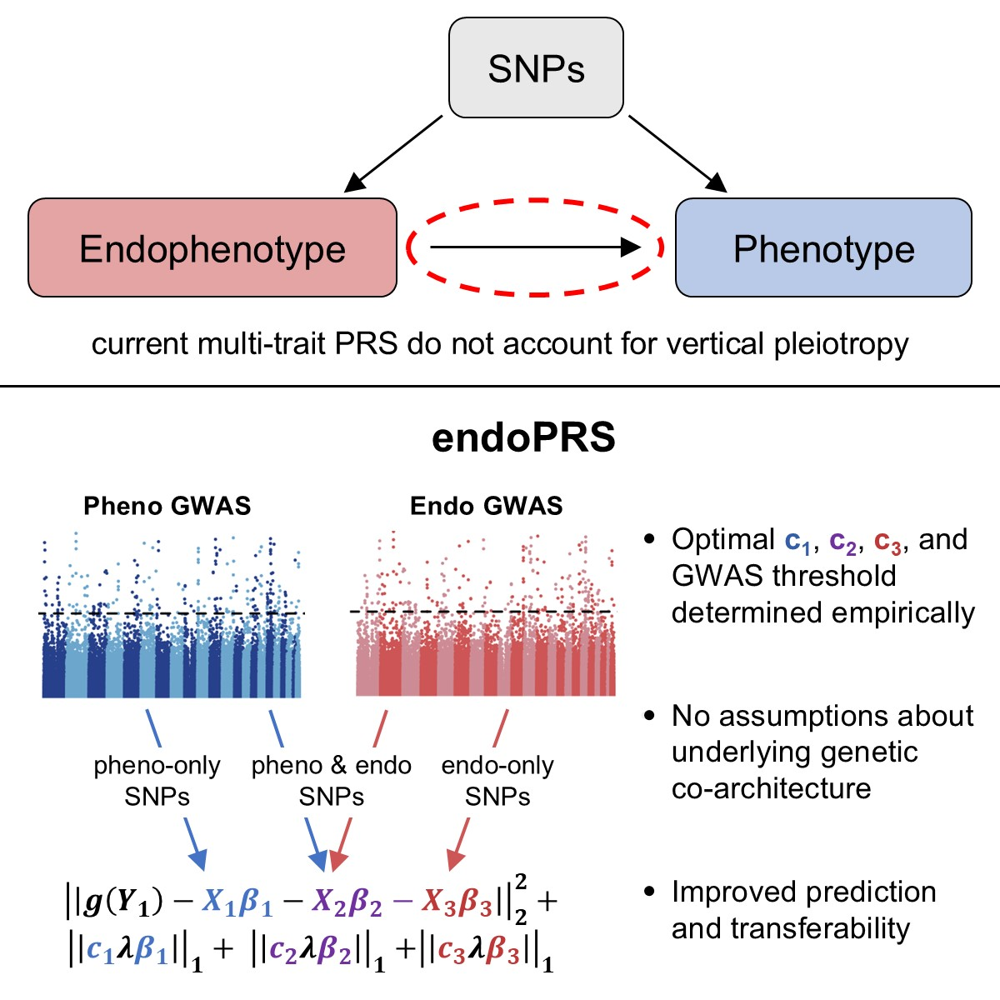

# endoPRS
R package to fit the endoPRS method. endoPRS is a weighted penalized regression model that incorporates information from endophenotypes to improve polygenic risk score prediction.


## Installation
To install endoPRS, you can use the following code:
```
library(devtools)
devtools::install_github("https://github.com/ekhar17/endoPRS")
library(endoPRS)
```

## Usage
The main function to fit endoPRS is the `fit_endoPRS` function. An example on how to run it:
```
endoPRS <- fit_endoPRS(G, map, fam, 
                       train_pheno, train_covar,
                       val_pheno, val_covar,
                       pheno_gwas, endo_gwas,
                       filter_hapmap = F,  hapmap = NULL, 
                       pheno_gwas_refit, endo_gwas_refit, 
                       save_folder = NULL)
```
Further information can be found in the vignette provided in the **vignettes/** folder. 

However, a relatively large number of models is fit in the grid search so this can take a long time for large data sets such as UK Biobank. Computation time can be significantly decreased by fitting the grid of models in parallel on a high performance computing cluster. For this, two functions `fit_endoPRS_single_iter` and `refit_endoPRS` were developed. They split the steps of endoPRS to allow for further parallelization. An example of how to run endoPRS on a high performance computing cluster can be found in the **HPC_example/** folder.

## Citations
Please cite:

Kharitonova, E.V., et. al. “EndoPRS: Incorporating Endophenotype Information to Improve Polygenic Risk Scores for Clinical Endpoints-A study in asthma." *American Journal of Human Genetics*. **112**, 1199-1214 (2025).
