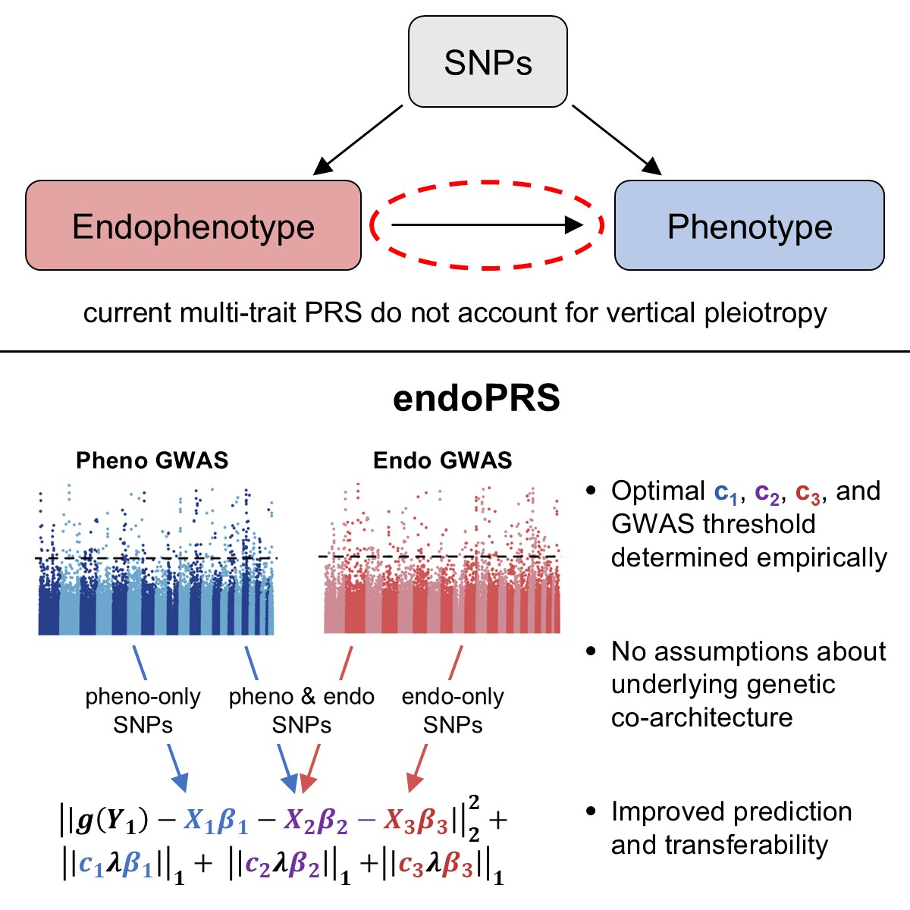

# endoPRS
R package to fit the endoPRS method. endoPRS is a weighted penalized regression model that incorporates information from endophenotypes to improve polygenic risk score prediction.


## Installation
To install endoPRS, you can use the following code:
```
library(devtools)
devtools::install_github("https://github.com/ekhar17/endoPRS")
library(endoPRS)
```

## Usage
The main function to fit endoPRS is the `fit_endoPRS` function. An example on how to run it:
```
endoPRS <- fit_endoPRS(G, map, fam, 
                       train_pheno, train_covar,
                       val_pheno, val_covar,
                       pheno_gwas, endo_gwas,
                       filter_hapmap = F,  hapmap = NULL, 
                       pheno_gwas_refit, endo_gwas_refit, 
                       save_folder = NULL)
```
Further information can be found in the vignette provided in the **vignettes/** folder. 

However, a relatively large number of models is fit in the grid search so this can take a long time for large data sets such as UK Biobank. Computation time can be significantly decreased by fitting the grid of models in parallel on a high performance computing cluster. For this, two functions `fit_endoPRS_single_iter` and `refit_endoPRS` were developed. They split the steps of endoPRS to allow for further parallelization. An example of how to run endoPRS on a high performance computing cluster can be found in the **HPC_example/** folder.

## endoPRS-SS (summary statistics)

`endoPRS-SS` fits the same weighted penalized regression model without individual level training
genotypes. Training is done from GWAS summary statistics plus an LD reference panel using a weighted
`lassosum2` model; individual level data is only needed for the validation set used to tune the
p-value thresholds, the endophenotype weights, and the `lassosum2` regularization parameters.

`endoPRS-SS` also allows the phenotype and the endophenotype to use **different** p-value thresholds,
whereas the individual level version applies one threshold to both traits.

```
ld_ref <- load_ld_ref("/path/to/ld_reference")

endoPRS_ss <- fit_endoPRS_ss(G, map, fam,
                             val_pheno, val_covar,
                             pheno_gwas, endo_gwas,
                             ld_ref = ld_ref,
                             threshes = c(1e-2, 1e-4, 1e-6),
                             threshes_endo = c(1e-2, 1e-4, 1e-6),
                             save_folder = NULL)
```

As with the individual level version, the grid can be fit in parallel on a cluster using
`fit_endoPRS_ss_single_iter` and then combined with `select_endoPRS_ss`. See **HPC_example/**.

`endoPRS-SS` does **not** require a modified version of `bigsnpr`. The compiled `lassosum2` solver in
`bigsnpr` already accepts per-variant `lambda` and `delta_plus_one` vectors, so endoPRS supplies the
weighted penalty factor itself and calls that solver directly.

## Citations
Please cite:

Kharitonova, E.V., et. al. “EndoPRS: Incorporating Endophenotype Information to Improve Polygenic Risk Scores for Clinical Endpoints-A study in asthma." *American Journal of Human Genetics*. **112**, 1199-1214 (2025).
